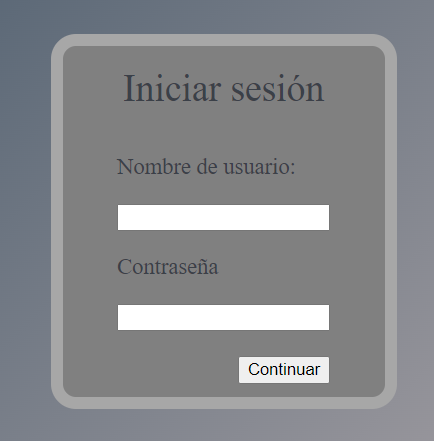
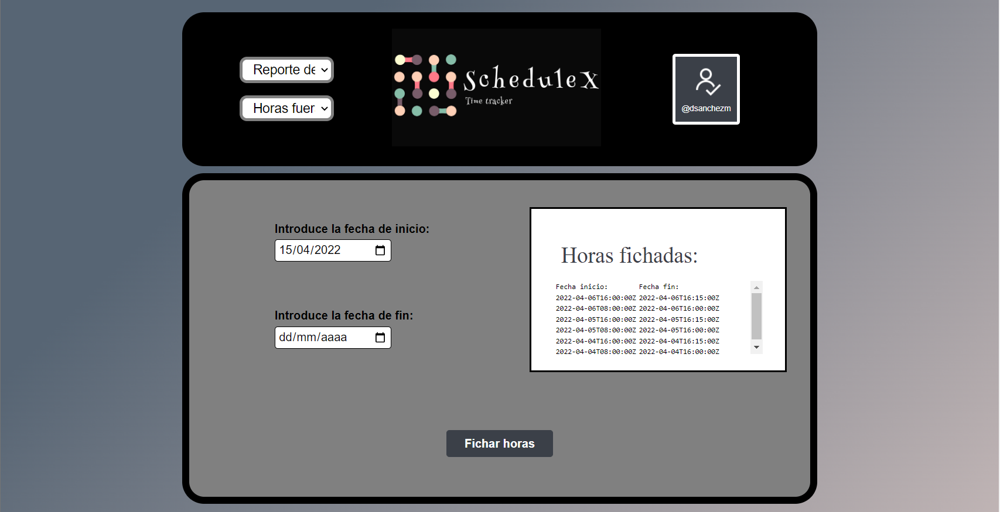
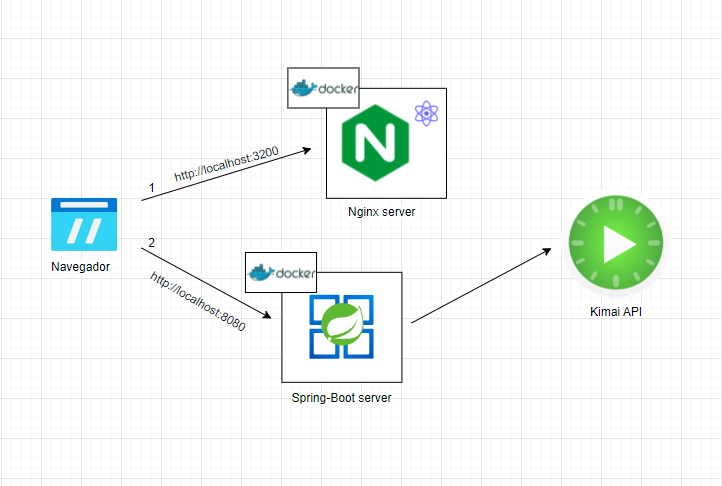
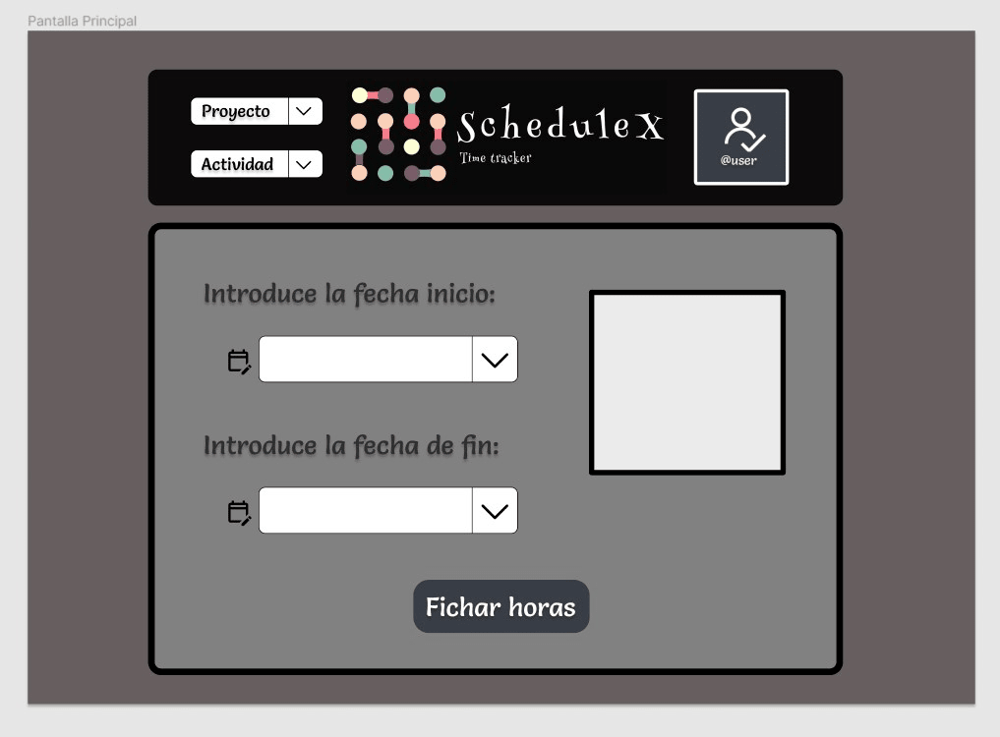

# Auto Kimai Diego

Auto Kimai is a tool which allows you to log your hours automatically on a server that uses [Kimai](https://github.com/kevinpapst/kimai2)

## Final Design

## Architecture Design

## Prototype Design

## Topics to review

Client
- Javascript
- React
- React Test
- Cypress

Backend
- Java
- Spring
- Maven
- Rest Protocol
- Junit Mockito
- Integration Test
- Performance Test k6
- Error handling
- OpenApi

Infra
- Docker
- Docker Compose

WoW
- Git
- Branches + Prs
- TDD
- DDD
- BDD
- 12 factor
- Agile Practices

Observability
- Metrics
- Logs
- Traces
- Alerts
